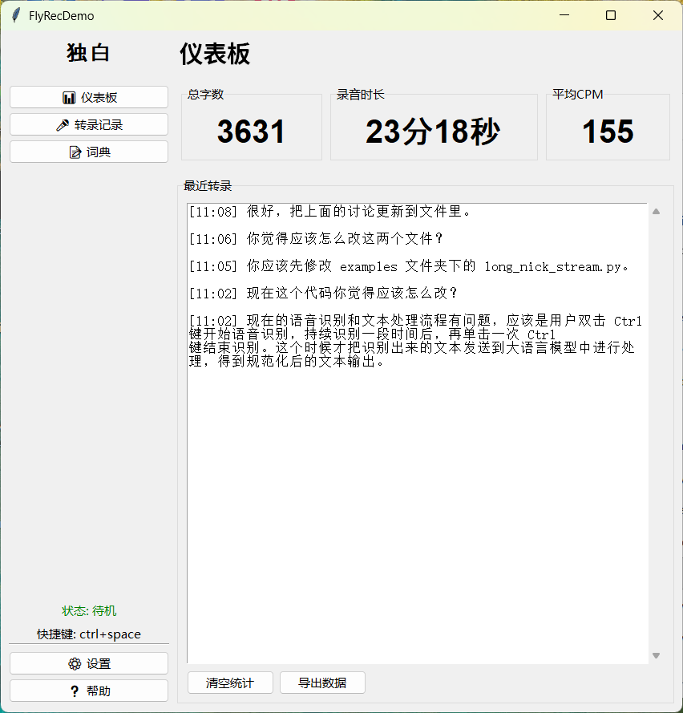
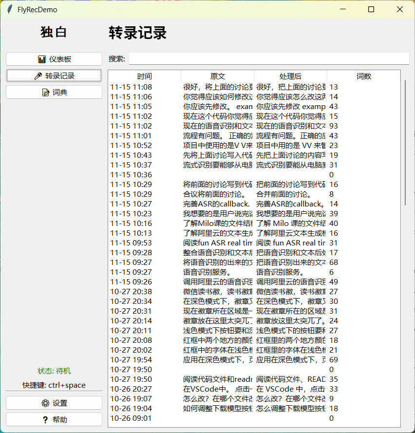
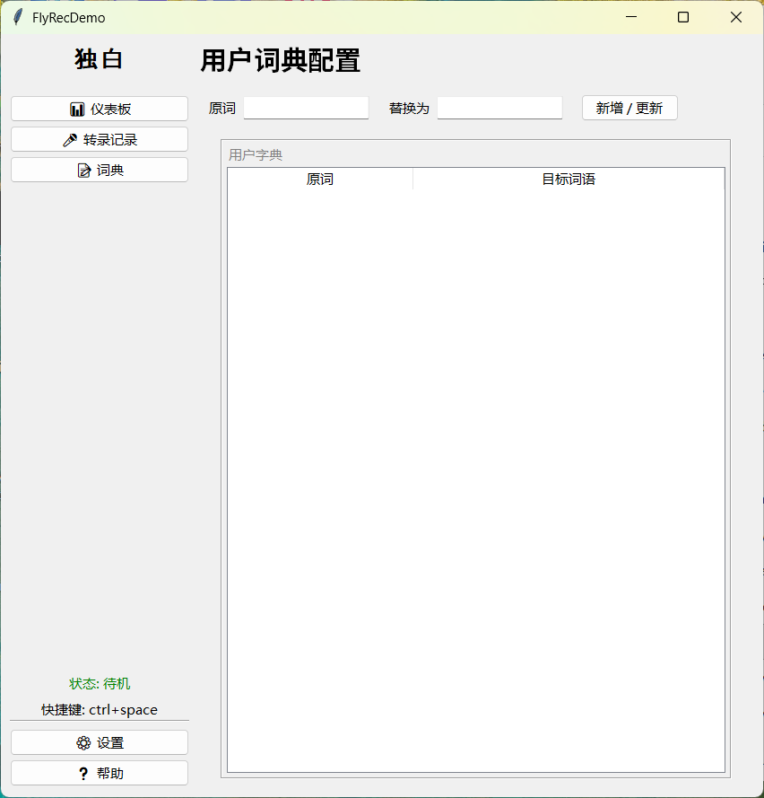
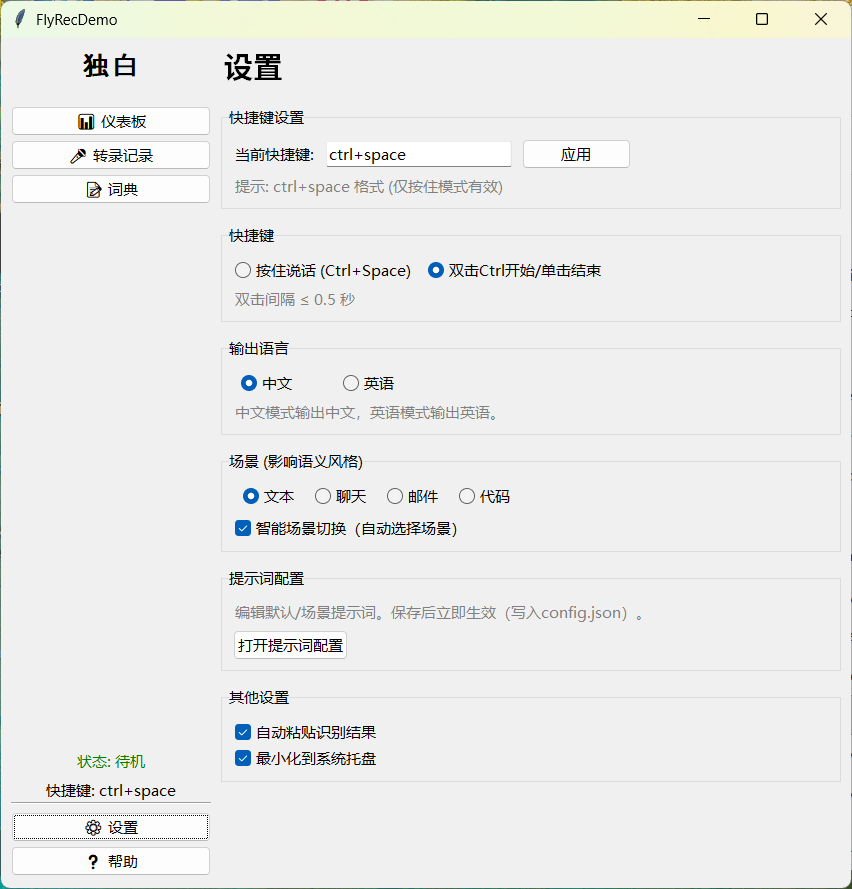

# FlyRec

FlyRec 是一个 Windows 桌面效率工具：按下快捷键开始说话，结束后自动得到“可直接粘贴使用”的文本（可按聊天/邮件/代码等场景做轻量润色），并自动粘贴到当前光标位置。

> 说明：仓库当前版本不包含“选中文本即时润色”的浮动按钮功能。

## 功能（以当前代码为准）

- 全局快捷键录音
   - `hold`：按住快捷键开始，松开结束
   - `double_ctrl`：双击 Ctrl 开始，录音中再按一次 Ctrl 结束（默认间隔 ≤0.5s）
- 在线实时语音识别：DashScope ASR（默认 `fun-asr-realtime`），结束后合并分段
- 场景提示词：文本/聊天/邮件/代码（可手动选择，或根据活动窗口自动切换）
- 输出语言：中文/英语（英语模式会附加英文输出约束，并做一次“含中文则重试”）
- 文本生成/润色：DashScope Qwen（默认 `qwen-plus`）
- 用户词典：模型调用前做“长词优先”的字符串替换
- 自动粘贴：复制到剪贴板并模拟 `Ctrl+V`
- 本地记录与统计：`transcripts.json`、`voice_stats.json`
- 录音提示：浮层提示 + 开始/结束 wav 音效（`assets/*.wav`）
- 托盘运行：关闭窗口默认最小化到托盘

## 界面预览

（截图位于 `assets/screenshots/`）









## 环境要求

- Windows 10/11（智能场景切换依赖 Windows API）
- Python ≥ 3.10
- 麦克风权限
- DashScope API Key（需要联网调用语音识别与大模型）

## 快速开始

### 1) 安装依赖

在项目根目录：

```powershell
python -m venv .venv
.\.venv\Scripts\Activate.ps1
python -m pip install -U pip
pip install .
```

如果你在新建的虚拟环境中遇到 `No module named pip`，可先执行：

```powershell
python -m ensurepip --upgrade
python -m pip install -U pip
```

备注：`pyaudio` 在 Windows 上如果安装失败，通常是缺少编译环境/不匹配的 wheel。优先尝试更换 Python 版本（3.10/3.11）或使用可用的预编译 wheel/conda 方案。

### 2) 配置 DashScope Key

推荐使用 `.env` 文件（最省事，且不污染系统环境变量）：

1) 复制示例文件：

```powershell
Copy-Item .env.example .env
```

2) 编辑 `.env`，填入：

```ini
DASHSCOPE_API_KEY=<你的_DashScope_Key>
```

或使用环境变量：

```powershell
$Env:DASHSCOPE_API_KEY = "<你的_DashScope_Key>"
```

安全提示：不要把 Key 写进代码或提交到仓库。

### 2.5) 准备本地配置（推荐）

本仓库会忽略本地运行配置与数据文件（避免把个人转录/统计/导出推送到公开仓库）。

首次运行前建议复制示例文件：

```powershell
Copy-Item config.example.json config.json
Copy-Item user_dictionary.example.json user_dictionary.json
Copy-Item transcripts.example.json transcripts.json
Copy-Item voice_stats.example.json voice_stats.json
```

### 3) 启动

```powershell
python flyrec_gui.py
```

首次运行会在根目录生成/更新本地数据文件（如 `transcripts.json`、`voice_stats.json`）。

## 使用方式（用户视角）

1. 打开程序，在“设置”里选择快捷键模式、输出语言、场景、是否启用智能模板切换、是否自动粘贴
2. 聚焦到任意输入框（聊天/邮件/IDE 等）
3. 触发快捷键开始说话，结束后等待数秒
4. 文本会自动粘贴到当前光标处，可在“转录记录”查看历史
5. 在“词典”中维护专有名词/固定写法

## 配置说明（config.json）

`config.json` 视为本地文件（已在 `.gitignore` 中忽略）。请基于 `config.example.json` 生成。

常用字段：

- `hotkey`：按住模式的组合键（例如 `ctrl+space`、`ctrl+win`）
- `hotkey_mode`：`hold` 或 `double_ctrl`
- `output_language`：`中文` 或 `英语`
- `prompts`：自定义提示词
   - `default`：默认 system prompt
   - `scenes`：场景提示词（如 `聊天`/`邮件`/`代码`）

可选字段（用于 services 层后端切换）：

```json
{
   "runtime": {
      "asr": { "backend": "dashscope", "model": "fun-asr-realtime" },
      "llm": { "backend": "dashscope", "model": "qwen-plus" }
   }
}
```

离线/联调（不调用真实 API）可使用 dummy：

```json
{
   "runtime": {
      "asr": { "backend": "dummy" },
      "llm": { "backend": "dummy" }
   }
}
```

## 智能模板切换（Windows）

FlyRec 会在开始录音时读取当前前台窗口的进程名/标题，并在“聊天/邮件/代码/文本”之间自动切换场景提示词。

- 依赖：`psutil` + `pywin32`
- 映射表：在 `flyrec_gui.py` 的 `app_template_mapping`
- 说明文档：`智能模板切换功能说明.md`

## 数据文件

- `config.json`：快捷键、模式、语言、提示词等配置（本地文件，勿提交）
- `transcripts.json`：识别/润色历史记录（本地文件，勿提交）
- `voice_stats.json`：累计统计与近 30 天聚合（本地文件，勿提交）
- `user_dictionary.json`：用户词典（原词 → 替换）（本地文件，勿提交）

仓库中提供对应的示例文件：

- `config.example.json`
- `transcripts.example.json`
- `voice_stats.example.json`
- `user_dictionary.example.json`

## 打包（PyInstaller）

目录模式（onedir）：

```powershell
pyinstaller .\FlyRecApp.spec
```

产物通常在 `dist/FlyRecApp/`（具体以 PyInstaller 输出为准）。

## 测试脚本（手工验证）

本仓库测试以脚本为主（非 pytest 套件）：

```powershell
python test_smart_template.py
python test_hotkey_modes.py
python test_recording_indicator.py
```

说明：
- `test_hotkey_modes.py` 需要手动按键验证（会等待按键退出）。

## 常见问题

- 智能场景不生效：确认已安装 `psutil`/`pywin32`，且前台窗口确实在切换
- 无法自动粘贴：部分应用会拦截模拟输入；确保目标窗口在前台、光标在输入框
- 无音效：确认 `assets/start_rec.wav` 与 `assets/end_rec.wav` 存在，且已安装 `soundfile`
- Key 不生效：确认已设置 `DASHSCOPE_API_KEY`，且没有在本地源码中写死覆盖

## 目录结构速览

- `flyrec_gui.py`：主 GUI（快捷键、场景、统计、托盘、音效）
- `flyrec/`：可复用核心模块（环境加载、智能场景、词典替换、识别器对接等）
- `services.py`：ASR/LLM 抽象与工厂（DashScope / Dummy）
- `legacy_hold_to_talk.py`：早期识别封装（兼容保留，逐步替换）
- `text_format.py`：Qwen 文本生成封装
- `FlyRecApp.spec`：PyInstaller 打包配置
- `assets/`：音效资源（wav）
- `CONTRIBUTING.md`：贡献指南（开发/风格/提交前检查）

## 许可证

本项目用于学习与个人效率提升。使用 DashScope 服务请遵守其服务条款。
